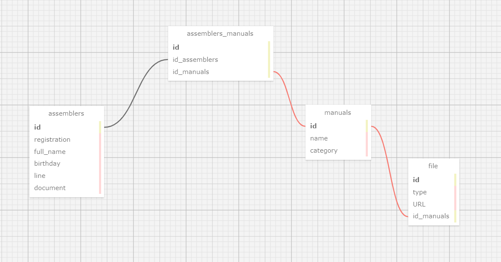

# Atividade Ponderada 3 - Modelagem de Banco de Dados

Pietra Pasqualini Batista
T13

---------------------------------------------------------------------------------

## Atividade:

&nbsp;&nbsp;&nbsp;&nbsp; O foco dessa modelagem foi o projeto que estamos desenvolvendo com a Dell. A partir dos encontros que tivemos com o parceiro, entendemos que havia a necessidade de criar um plataforma onde fosse possível realizar o treinamentos dos funcionários das linhas de montagem da empresa de forma mais personalizada e organizada. Dito isso, estamos desenvolvendo uma aplicação web para tornar o processo de treinamento mais eficiente, com ênfase na funcionalidade de delegação de manuais para diversos montadores, além de armazenamento de arquivos e gráficos de desempenho de cada linha e funcionário. 

&nbsp;&nbsp;&nbsp;&nbsp; Com base nisso, eu desenvolvi o seguinte bancos de dados utilizando o SQL Designer (https://sql.toad.cz/): 

Figura 1 - Modelagem de Banco de Dados  
  

Material autoral (2024)

&nbsp;&nbsp;&nbsp;&nbsp; Para criar a modelagem acima, os seguintes requisitos foram considerados:

- Todos os montadores devem ter em seu cadastro dados como: número de matrícula, nome completo, data de nascimento, número de documento e a linha na qual o montador pertence.
- Todos os manuais deverão ter um nome de identificação e uma categoria específica.
- Cada arquivo deve ser classificado em um tipo (pdf, vídeo) e uma URL, além de referenciar um manual.

&nbsp;&nbsp;&nbsp;&nbsp;A modelagem é essencial para entender como as informações são estruturadas no banco de dados. A chave primária é a maneira de identificar de forma única cada registro em uma tabela e as utilizadas nesse modelo são as 'id' de cada tabela. Já as estrangeiras são utilizadas para estabelecer um vínculo entre os dados. 

&nbsp;&nbsp;&nbsp;&nbsp;A partir disso, foi possível criar relações entre as tabelas. Uma das relações foi de 1:N (um para muitos), onde um registro de uma tabela pode se vincular a vários registros de outra tabela, mas um registro da segunda tabela pode ser associado à apenas um registro da outra. Na modelagem desenvolvida, um manual ('manuals') pode ter vários arquivos ('files') associados a ele. Enquanto cada arquivo só pode ser vinculado a apenas um manual, indicado pela chave estrangeira 'id_manuals' na tabela 'files'. Escolhi desta maneira porque os manuais disponíveis aos funcionários da Dell podem conter diversos arquivos, no entanto os arquivos só podem ser associados a um manual. 

&nbsp;&nbsp;&nbsp;&nbsp;Outro relacionamento dessa modelagem é o de N:N, onde vários registros em uma tabela podem estar vinculados a diversos registros em uma outra tabela e vice-versa. Esse tipo de relacionamento requer uma outra tabela que gerencia essas associações. Nessa modelagem é possível visualizar que um montador ('assemblers') pode estar vinculado a vários manuais ('manuals') e um manual pode ser delegado a vários montadores. A tabela 'assemblers_manuals' é utilizada para juntar os dados dessas duas tabelas contendo as chaves entrangeiras 'id_assemblers' e 'id_manuals', referenciando as chaves primárias de suas respectivas tabelas. 

&nbsp;&nbsp;&nbsp;&nbsp;Os arquivos .xml e .sql dessa modelagem estão disponíveis nesse repositório. 
